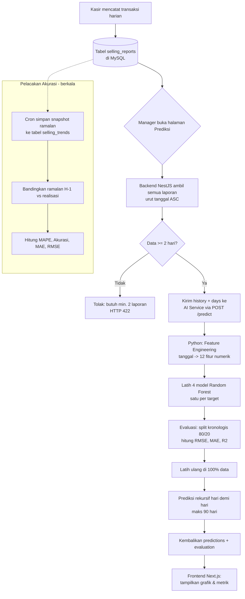

# Dokumentasi Metode AI — Sistem Prediksi Penjualan "Vora"

> Dokumen ini merangkum **alur kerja**, **metode**, **rumus**, dan **cara membaca hasil**
> dari fitur kecerdasan buatan (AI) pada aplikasi Vora. Disusun sebagai bahan
> pemahaman & persiapan sidang Tugas Akhir.

**Metode utama:** Random Forest Regression (scikit-learn)
**Tujuan:** Meramalkan tren penjualan harian (time-series forecasting)
**Target prediksi:** pendapatan kotor, laba bersih, jumlah transaksi, item terjual

---

## Daftar Isi

1. [Gambaran Umum](#1-gambaran-umum)
2. [Alur Kerja AI (End-to-End)](#2-alur-kerja-ai-end-to-end)
3. [Arsitektur Sistem](#3-arsitektur-sistem)
4. [Metode: Random Forest Regression](#4-metode-random-forest-regression)
5. [Feature Engineering](#5-feature-engineering)
6. [Pelatihan & Evaluasi Model](#6-pelatihan--evaluasi-model)
7. [Prediksi Masa Depan (Recursive Forecasting)](#7-prediksi-masa-depan-recursive-forecasting)
8. [Pelacakan Akurasi (Tabel `selling_trends`)](#8-pelacakan-akurasi-tabel-selling_trends)
9. [Rumus-Rumus Metrik](#9-rumus-rumus-metrik)
10. [Cara Membaca Dashboard](#10-cara-membaca-dashboard)
11. [Ringkasan & Poin Kunci Sidang](#11-ringkasan--poin-kunci-sidang)

---

## 1. Gambaran Umum

AI di Vora bertugas **memprediksi tren penjualan ke depan** berdasarkan riwayat
laporan penjualan harian. Untuk setiap hari ke depan, sistem meramalkan **4 nilai**:

| Target | Keterangan |
|---|---|
| `gross_revenue` | Pendapatan kotor |
| `net_profit` | Laba bersih |
| `total_transaction` | Jumlah transaksi |
| `total_items_sold` | Jumlah item terjual |

**Kalimat kunci:**
> Sistem menggunakan **Random Forest Regression** untuk melakukan **peramalan
> deret waktu (time-series forecasting)** penjualan, dengan pendekatan
> **feature engineering** — mengubah data tanggal menjadi fitur numerik yang
> dapat dipelajari model.

---

## 2. Alur Kerja AI (End-to-End)



**Ringkas dalam kata:**

1. **Pencatatan** — transaksi harian terkumpul menjadi laporan di tabel `selling_reports`.
2. **Permintaan** — saat manager membuka halaman prediksi, backend mengambil seluruh riwayat.
3. **Pengiriman** — backend mengirim riwayat ke layanan AI Python (HTTP).
4. **Feature engineering** — tanggal diubah menjadi 12 fitur numerik.
5. **Pelatihan** — 4 model Random Forest dilatih (satu per target).
6. **Evaluasi** — model diuji pada 20% data terbaru; dihitung RMSE, MAE, R².
7. **Prediksi** — model dilatih ulang di seluruh data, lalu meramal hari demi hari secara rekursif.
8. **Penyajian** — hasil ditampilkan sebagai grafik + kartu metrik di frontend.
9. **Pelacakan akurasi** — snapshot ramalan disimpan ke `selling_trends`, kemudian dibandingkan dengan realisasi untuk menghitung akurasi operasional.

> **Catatan desain penting:** model **dilatih ulang setiap request** (on-the-fly),
> tidak disimpan ke file. Karena datanya kecil (ratusan baris) dan Random Forest
> cepat, ini memastikan model selalu memakai data terbaru.

---

## 3. Arsitektur Sistem

Sistem terdiri dari **3 layanan terpisah**:

```
[Next.js Frontend]  -->  [NestJS Backend]  -->  [FastAPI AI Service (Python)]
   (tampilan)             (jembatan data)          (otak prediksi)
```

| Komponen | Bahasa/Framework | Tugas | File utama |
|---|---|---|---|
| **AI Service** | Python + FastAPI | Melatih model & memprediksi | `ai/main.py`, `ai/predictor.py` |
| **Backend** | TypeScript + NestJS | Ambil data DB, panggil AI, teruskan hasil | `ai-prediction.service.ts` |
| **Frontend** | TypeScript + Next.js | Menampilkan grafik prediksi | halaman prediksi manager |

**Kenapa AI dipisah dengan Python?**
Library machine learning terbaik (scikit-learn, pandas, numpy) berada di ekosistem
Python. Backend NestJS (JavaScript) tidak memilikinya, sehingga berperan sebagai
**jembatan**: mengambil data dari MySQL → mengirim ke Python via HTTP → menerima hasil.

**Aturan gerbang di backend** (`ai-prediction.service.ts`):
- Data historis **< 2** → tolak dengan HTTP **422** (butuh minimal 2 hari untuk belajar).
- Layanan AI membalas non-OK → HTTP **502** (Bad Gateway).
- Layanan AI tak terjangkau → HTTP **503** (Service Unavailable).

---

## 4. Metode: Random Forest Regression

### Apa itu Random Forest?

Random Forest = **kumpulan banyak Decision Tree** (di proyek ini: **100 pohon**).

- Satu **Decision Tree** membuat prediksi lewat serangkaian aturan "if-else" pada
  fitur (misal: "jika hari Sabtu **dan** rata-rata pendapatan 7 hari terakhir tinggi
  → prediksi pendapatan tinggi").
- Satu pohon mudah **overfitting** (menghafal data, bukan belajar pola).
- **Random Forest** menanam 100 pohon; tiap pohon dilatih pada subset data & fitur
  yang diacak (*bootstrap + bagging*). Hasil akhir = **rata-rata prediksi semua pohon**.
  Perata-rataan inilah yang membuat prediksi stabil dan tahan noise.

### Alasan memilih Random Forest

- **Hemat data** — tidak butuh ribuan baris seperti LSTM. Cocok untuk data UMKM yang terbatas.
- **Menangkap pola non-linier** otomatis (mis. efek akhir pekan) tanpa perumusan manual.
- **Tahan outlier & noise** karena hasil dirata-rata dari banyak pohon.
- **Menyediakan feature importance** — dapat menunjukkan fitur paling berpengaruh (`ai/feature_importance.py`).
- **Cepat dilatih** — cocok untuk pelatihan ulang tiap request.

> **Jika ditanya "kenapa bukan ARIMA/LSTM?":** ARIMA mengasumsikan pola linier dan
> data stasioner; LSTM butuh data sangat banyak dan komputasi mahal. Dengan volume
> data UMKM yang terbatas dan pola musiman mingguan yang jelas, Random Forest memberi
> keseimbangan terbaik antara akurasi, kebutuhan data, dan kecepatan.

### Hyperparameter (`ai/predictor.py`)

```python
RandomForestRegressor(
    n_estimators=100,     # jumlah pohon
    max_depth=8,          # kedalaman maks tiap pohon -> cegah overfitting
    min_samples_leaf=1,
    random_state=42,      # seed acak -> hasil selalu konsisten (reproducible)
    n_jobs=-1,            # pakai semua core CPU -> training paralel
)
```

- `max_depth=8` membatasi kedalaman pohon agar tidak menghafal data.
- `random_state=42` memastikan hasil **sama setiap dijalankan** (penting untuk reproduksibilitas skripsi).

---

## 5. Feature Engineering

Random Forest **tidak mengerti tanggal**, sehingga tanggal harus diubah menjadi
angka. Proses ini disebut **feature engineering** (fungsi `_build_features` di
`ai/predictor.py`). Dari setiap tanggal dibuat **12 fitur**:

### A. Fitur kalender — menangkap pola musiman

| Fitur | Arti | Kegunaan |
|---|---|---|
| `day_of_week` | hari (0=Senin … 6=Minggu) | pola akhir pekan lebih ramai |
| `day_of_month` | tanggal (1–31) | pola gajian / awal-akhir bulan |
| `month` | bulan | musiman bulanan |
| `year` | tahun | tren jangka panjang |
| `day_of_year` | hari ke- dalam setahun | musiman tahunan |
| `days_since_start` | umur bisnis (hari) | tren pertumbuhan |

### B. Fitur rolling / lag — menangkap momentum terkini

- `gross_revenue_r3`, `gross_revenue_r7` = rata-rata pendapatan **3 hari** & **7 hari** terakhir.
- Hal sama untuk `net_profit` dan `total_transaction`.

> **Kenapa rolling average penting?** Inilah cara Random Forest — yang aslinya
> bukan model deret waktu — **"melihat masa lalu"**. Rata-rata 7 hari terakhir
> memberi konteks "sedang ramai atau sepi", sehingga masalah forecasting berubah
> menjadi masalah regresi biasa.
>
> Jika penguji bertanya *"Random Forest kan bukan model time series, kok bisa untuk
> forecasting?"* — **jawabannya ada pada fitur rolling ini.**

---

## 6. Pelatihan & Evaluasi Model

Berada di fungsi `fit()` (`ai/predictor.py`).

### a. Empat model terpisah

Satu `RandomForestRegressor` untuk **tiap target** (revenue, profit, transaksi, item)
→ total **4 model**. Terpisah karena tiap target punya pola & skala berbeda; model
terpisah lebih akurat daripada satu model untuk semua.

### b. Split train/test kronologis 80/20

- **80% data awal** (paling lama) → melatih.
- **20% data akhir** (terbaru) → menguji.
- **Kronologis, bukan acak** — melatih di "masa lalu", menguji di "masa depan".
  Jika diacak, model bisa "mengintip masa depan" (**data leakage**). Ini praktik
  yang benar untuk time series.

### c. Metrik evaluasi (pada test set)

- **RMSE** — akar rata-rata kuadrat error; menghukum kesalahan besar.
- **MAE** — rata-rata selisih absolut prediksi vs aktual.
- **R²** — seberapa baik model menjelaskan variasi data (1 = sempurna, 0 = setara menebak rata-rata).

> R² hanya dihitung bila test set ≥ 2 data (R² tak terdefinisi untuk 1 sampel).
> Ini mencegah nilai menyesatkan saat data sangat sedikit.

### d. Latih ulang di seluruh data

Setelah evaluasi, model **dilatih ulang memakai 100% data** agar prediksi ke depan
sekuat mungkin. Jadi split 80/20 hanya untuk **mengukur kualitas**; prediksi
sesungguhnya memakai model yang belajar dari semua data.

---

## 7. Prediksi Masa Depan (Recursive Forecasting)

Berada di fungsi `predict()` (`ai/predictor.py`).

Model meramal **satu hari ke depan pada satu waktu**, lalu **hasil ramalan hari itu
dipakai untuk menghitung fitur rolling hari berikutnya**. Pendekatan ini disebut
**recursive / iterative multi-step forecasting**.

Contoh prediksi 3 hari:

1. **Hari +1:** hitung fitur (termasuk rata-rata 7 hari terakhir dari data asli) → prediksi. Simpan.
2. **Hari +2:** rata-rata 7 hari sekarang **menyertakan prediksi hari +1** → prediksi lagi.
3. **Hari +3:** menyertakan prediksi +1 & +2 → prediksi lagi.

**Kelemahan (akui jujur saat sidang):** karena prediksi menumpuk di atas prediksi,
**error dapat terakumulasi** — makin jauh ke depan makin tidak akurat. Karena itu
prediksi dibatasi **maksimal 90 hari**. Prediksi juga di-*clamp* ≥ 0 agar tidak ada
nilai negatif.

---

## 8. Pelacakan Akurasi (Tabel `selling_trends`)

Bedakan dua hal:

- **Prediksi live** (bagian 7) = ramalan masa depan, dihitung saat halaman dibuka.
- **`selling_trends`** = **arsip/snapshot** ramalan yang pernah dibuat, disimpan agar
  kelak bisa **dibandingkan dengan realisasi**.

Logika akurasi (`accuracy.util.ts`):

1. **`pickFreshestForecasts`** — untuk tiap tanggal, ambil ramalan paling segar yang
   dibuat **sebelum** hari-H (mensimulasikan "ramalan H-1"). Ramalan yang dibuat pada
   hari yang sama atau sesudahnya diabaikan (karena itu tidak adil / bocor).
2. **`computeAccuracySummary`** — bandingkan ramalan vs realisasi, lalu hitung
   **MAPE**, **Akurasi (= 100 − MAPE)**, **MAE**, dan **RMSE**.

> MAPE mengecualikan hari dengan aktual = 0 (menghindari pembagian nol).

---

## 9. Rumus-Rumus Metrik

Notasi: **yᵢ** = aktual, **ŷᵢ** = prediksi, **n** = jumlah data, **ȳ** = rata-rata aktual.

### MAE — Mean Absolute Error
```
MAE = (1/n) × Σ |yᵢ − ŷᵢ|
```
Rata-rata selisih absolut antara aktual dan prediksi.

### RMSE — Root Mean Squared Error
```
RMSE = √( (1/n) × Σ (yᵢ − ŷᵢ)² )
```
Akar rata-rata **kuadrat** error. Karena dikuadratkan, kesalahan besar dihukum lebih
berat. Selalu berlaku **RMSE ≥ MAE**; jika RMSE ≫ MAE berarti ada beberapa prediksi
yang meleset sangat jauh (outlier).

### R² — Koefisien Determinasi
```
        Σ (yᵢ − ŷᵢ)²          SS_residual
R² = 1 − ─────────────  = 1 − ─────────────
        Σ (yᵢ − ȳ)²           SS_total
```
Membandingkan model dengan tebakan naif "selalu pakai rata-rata".
- R² = 1 → prediksi sempurna.
- R² = 0 → setara menebak rata-rata.
- R² < 0 → lebih buruk daripada menebak rata-rata.

### MAPE — Mean Absolute Percentage Error
```
MAPE = (100 / m) × Σ ( |yᵢ − ŷᵢ| / |yᵢ| )     (hanya untuk yᵢ ≠ 0)
```
m = jumlah data yang aktualnya bukan 0. Rata-rata error dalam **persen**.

### Akurasi
```
Akurasi = 100 − MAPE
```
Konversi MAPE agar mudah dibaca (MAPE 5.5% → Akurasi 94.5%). Di-*clamp* minimal 0.

### Random Forest (agregasi)
```
ŷ = (1/T) × Σ ŷ_t         (t = 1 … T,  T = 100 pohon)
```
Tiap pohon memilih split yang meminimalkan MSE simpul:
```
MSE_simpul = (1/n) × Σ (yᵢ − ȳ_simpul)²
```

### Contoh perhitungan mini

Aktual vs prediksi 3 hari (dalam ribuan):

| Hari | Aktual (y) | Prediksi (ŷ) | y−ŷ | \|y−ŷ\| | (y−ŷ)² |
|---|---|---|---|---|---|
| 1 | 100 | 110 | −10 | 10 | 100 |
| 2 | 200 | 180 | +20 | 20 | 400 |
| 3 | 150 | 150 | 0 | 0 | 0 |

- **MAE** = (10+20+0)/3 = **10**
- **RMSE** = √((100+400+0)/3) = √166.7 = **12.9**
- **MAPE** = (0.10+0.10+0)/3 × 100 = **6.7%**
- **Akurasi** = 100 − 6.7 = **93.3%**
- ȳ = 150 → SS_res = 500, SS_tot = 5000 → **R² = 1 − 500/5000 = 0.90**

---

## 10. Cara Membaca Dashboard

### Panel "Evaluasi Model (Test Set)"

Mengukur **kualitas model** pada data yang belum pernah dilihatnya. Contoh: dari 201
data historis, 160 untuk melatih dan 41 untuk menguji (split kronologis 80/20).
Untuk tiap target ditampilkan RMSE, MAE, dan R².

> R² 0.5–0.62 **wajar** untuk data penjualan riil yang penuh keacakan harian. R²
> sangat tinggi (>0.9) pada data bisnis nyata justru mencurigakan (tanda overfitting
> atau data leakage).

### Panel "Akurasi Prediksi (Prediksi vs Realisasi)"

Mengukur **seberapa dekat ramalan dengan kenyataan di lapangan**. Grafik
membandingkan garis **Aktual** vs **Prediksi** (ramalan H-1 dari `selling_trends`)
hari demi hari. Empat kartu: **Akurasi** (=100−MAPE), **MAPE**, **MAE**, **RMSE**.

### Kunci: kenapa R² sedang (mis. 0.62) tapi Akurasi tinggi (mis. 94.5%)?

**Keduanya benar** karena mengukur hal berbeda pada data berbeda:

| | Panel Evaluasi | Panel Akurasi |
|---|---|---|
| Mengukur apa | Variasi yang dijelaskan model (R²) | % error ramalan (MAPE) |
| Data | 41 data uji yang disembunyikan | Snapshot ramalan H-1 |
| Sifat | Ujian ketat (model buta) | Ramalan jarak dekat (1 hari) |

**Analogi:** R² seperti nilai ujian tanpa contekan (sulit → sedang). Akurasi 94.5%
seperti menebak cuaca **besok** (jarak 1 hari, model tahu kondisi hari ini → sangat
dekat). Prediksi jarak dekat selalu lebih akurat daripada evaluasi model umum.

> **Antisipasi:** RMSE di panel evaluasi bisa jauh lebih besar daripada RMSE di panel
> akurasi untuk target yang sama. Itu **bukan bug** — keduanya diukur pada himpunan
> data yang berbeda (data uji vs snapshot H-1).

---

## 11. Ringkasan & Poin Kunci Sidang

**Ringkasan 30 detik:**
> Vora memakai **Random Forest Regression** dari scikit-learn untuk **meramalkan
> penjualan**. Data tanggal diubah menjadi **12 fitur** lewat *feature engineering* —
> fitur kalender untuk pola musiman dan **rata-rata bergerak 3 & 7 hari** untuk
> momentum. Ada **4 model terpisah**. Model dievaluasi dengan **split kronologis
> 80/20** memakai **RMSE, MAE, R²**, lalu dilatih ulang di seluruh data. Prediksi
> dilakukan **secara rekursif** hari demi hari. Layanan AI berjalan terpisah di
> **Python/FastAPI**, dipanggil backend **NestJS** via HTTP.

**Yang wajib dihafal:**
- Metode: **Random Forest Regression**, 100 pohon, `max_depth=8`, `random_state=42`.
- **12 fitur** = 6 kalender + 6 rolling (3h & 7h dari revenue, profit, transaksi).
- **4 model** (satu per target).
- **Split kronologis 80/20** (bukan acak — mencegah data leakage).
- Rumus **MAE, RMSE, MAPE, Akurasi** (hafal); konsep **R²** (paham).
- **Recursive forecasting**, batas **90 hari**, kelemahan = akumulasi error.
- R² sedang + Akurasi tinggi = **konsisten**, karena mengukur hal berbeda.

**Kejujuran ilmiah (nilai plus):**
- Akui kelemahan recursive forecasting (error menumpuk untuk horizon jauh).
- Jelaskan R² sedang sebagai hal wajar pada data riil, bukan kegagalan.
- Tekankan pencegahan overfitting (`max_depth`, ensemble) & data leakage (split kronologis).

---

*Dokumen ini merangkum implementasi nyata pada berkas: `ai/main.py`, `ai/predictor.py`,
`ai/feature_importance.py`, `server/src/features/ai-prediction/ai-prediction.service.ts`,
dan `server/src/features/selling-trend/accuracy.util.ts`.*
